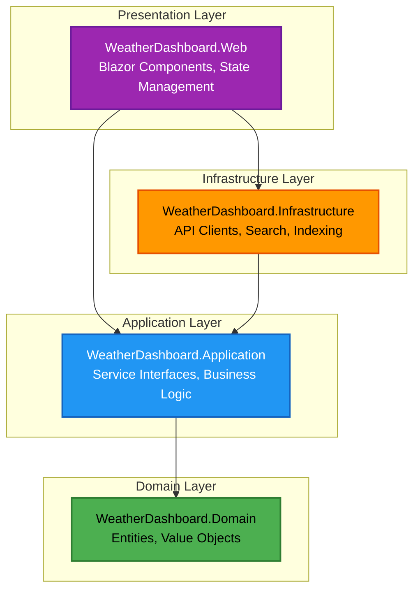
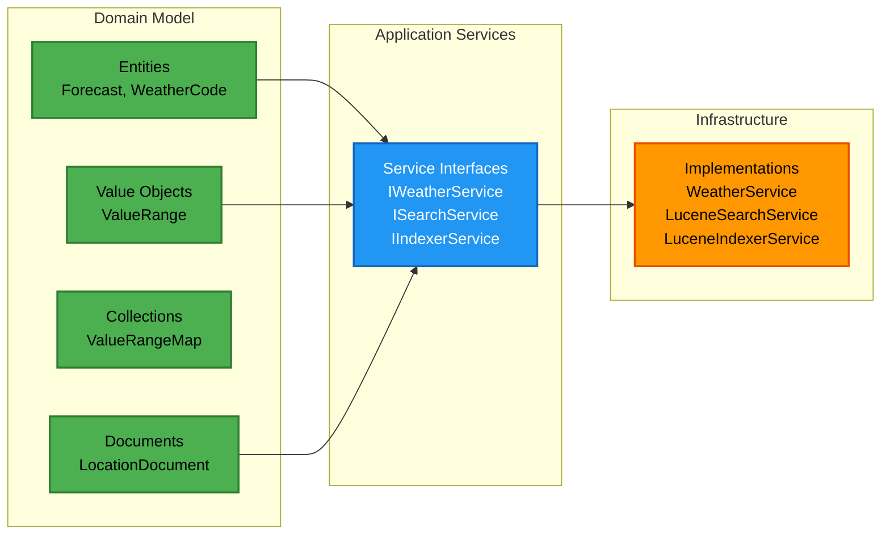
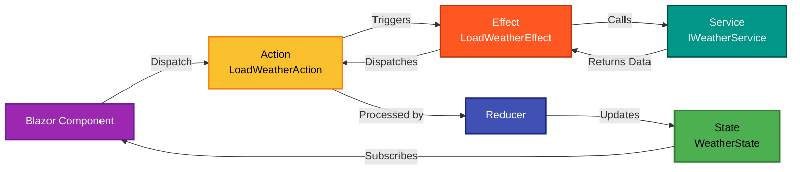

# Weather Dashboard Blazor Demo

[](https://dotnet.microsoft.com/)
[](https://dotnet.microsoft.com/apps/aspnet/web-apps/blazor)
[](https://www.docker.com/)


A modern, interactive weather dashboard built with Blazor Server, demonstrating Clean Architecture principles, Domain-Driven Design patterns, and state-of-the-art .NET development practices.

<details>
<summary>Table of Contents</summary>

- [General Overview](#general-overview)
- [Project Structure](#project-structure)
  - [Solution File](#solution-file)
  - [Project Files](#project-files)
  - [Directory Structure](#directory-structure)
- [Prerequisites](#prerequisites)
- [Dependencies](#dependencies)
  - [Domain Layer](#domain-layer)
  - [Application Layer](#application-layer)
  - [Infrastructure Layer](#infrastructure-layer)
  - [Web Layer](#web-layer)
- [Architecture](#architecture)
  - [Clean Architecture](#clean-architecture)
  - [Domain-Driven Design](#domain-driven-design)
  - [Flux Pattern (State Management)](#flux-pattern-state-management)
- [Getting Started](#getting-started)
  - [Local Development](#local-development)
  - [Running with Docker](#running-with-docker)
- [Configuration](#configuration)
  - [Cookie Settings](#cookie-settings)
  - [Default Location](#default-location)
  - [Local Storage](#local-storage)
  - [Localization](#localization)
  - [Redis Configuration](#redis-configuration)
- [External Services](#external-services)
  - [Open-Meteo Weather API](#open-meteo-weather-api)
- [Implementation Details](#implementation-details)
  - [Mapping Strategies](#mapping-strategies)
  - [Caching Strategy](#caching-strategy)
  - [Search Implementation](#search-implementation)
  - [Security](#security)
- [Testing](#testing)
  - [Running Tests](#running-tests)
  - [Test Framework](#test-framework)
  - [Code Coverage](#code-coverage)
- [Code Quality](#code-quality)

</details>

## General Overview

Weather Dashboard is a production-ready demonstration of enterprise-grade .NET application development, showcasing:

- **Clean Architecture** with strict layer separation and dependency inversion
- **Blazor Server** with interactive server-side rendering
- **Fluxor** for predictable state management using the Flux pattern
- **Lucene.NET** for fast, full-text location search
- **FusionCache** with multi-level caching (memory + distributed)
- **Open-Meteo API** integration with resilience patterns
- **Radzen Blazor** component library with Material Design
- **Comprehensive testing** with xUnit v3, AwesomeAssertions, and snapshot testing

The application provides a rich user experience with real-time weather data, location search, and beautiful visualizations, while maintaining maintainability through clean separation of concerns.

## Project Structure

### Solution File

The solution uses the modern XML-based `.slnx` format (requires Visual Studio 2022 17.9+, Rider 2024.1+, or recent .NET CLI):

- `WeatherDashboard.slnx` - Solution file containing all projects and solution items

### Project Files

**Source Projects:**
- `src/WeatherDashboard.Domain/` - Core domain entities and value objects
- `src/WeatherDashboard.Application/` - Business logic and application services
- `src/WeatherDashboard.Infrastructure/` - External service implementations
- `src/WeatherDashboard.Web/` - Blazor Server web application

**Test Projects:**
- `tests/WeatherDashboard.Domain.UnitTests/` - Domain layer unit tests
- `tests/WeatherDashboard.Application.UnitTests/` - Application layer unit tests
- `tests/WeatherDashboard.Infrastructure.UnitTests/` - Infrastructure layer unit tests
- `tests/WeatherDashboard.Infrastructure.IntegrationTests/` - Infrastructure integration tests
- `tests/WeatherDashboard.Web.UnitTests/` - Web layer unit tests
- `tests/WeatherDashboard.Web.UiTests/` - UI component tests with bUnit

### Directory Structure

```
src/
├── WeatherDashboard.Domain/
│   ├── Collections/         # Specialized collections (ValueRangeMap)
│   ├── Common/             # Shared types and base classes
│   ├── Entities/           # Domain entities (Weather, Documents)
│   ├── Serialization/      # JSON serializer contexts
│   └── ValueObjects/       # Domain value objects
├── WeatherDashboard.Application/
│   ├── Common/
│   │   ├── Extensions/     # Extension methods (WeatherCodeExtensions)
│   │   ├── Interfaces/     # Service interfaces
│   │   ├── Serialization/  # JSON/MessagePack converters
│   │   └── Utilities/      # Utility classes (HashUtility)
│   └── Contracts/          # DTOs and mappers (Riok.Mapperly)
├── WeatherDashboard.Infrastructure/
│   ├── Configuration/      # Configuration options (RedisOptions)
│   ├── Data/              # Seed data (embedded JSON)
│   ├── Extensions/         # Service registration
│   ├── Persistence/        # Lucene directory factory
│   ├── Providers/          # SystemTimeProvider
│   ├── Serialization/      # Weather API serialization contexts
│   └── Services/
│       ├── BackgroundServices/  # LocationIndexerBackgroundService
│       ├── Indexer/            # Document indexing
│       ├── Search/             # Lucene search
│       └── Weather/            # Weather API client + rate limiting
└── WeatherDashboard.Web/
    ├── Configuration/      # Settings classes
    ├── Features/
    │   └── Weather/       # Weather feature components
    │       ├── Components/    # Blazor components
    │       └── StateManagement/  # Fluxor (State/Actions/Effects/Reducers)
    ├── Localizations/     # Resource files (.resx)
    ├── Middlewares/       # QueryCultureCookieMiddleware
    ├── Properties/        # Launch settings
    ├── Resources/         # Static resources
    ├── styles/           # Sass source files
    └── wwwroot/          # Static web assets (fonts, compiled CSS)
```

## Prerequisites

- **.NET SDK 10.0.100** or later ([Download](https://dotnet.microsoft.com/download))
- **pnpm 10.26.0** or later ([Installation](https://pnpm.io/installation))
- **Node.js 18+** (for pnpm and Sass compilation)
- **Visual Studio 2022 17.9+**, **Rider 2024.1+**, or **.NET CLI** (for `.slnx` support)
- **(Optional) Docker** for containerized deployment

### Platform Support

- Windows 10/11, macOS 12+, or Linux (Ubuntu 20.04+, Debian 11+, etc.)
- Development tools: Visual Studio, Rider, VS Code with C# Dev Kit

## Dependencies

The project uses **Central Package Management** (CPM) with all versions defined in `Directory.Packages.props`.

### Domain Layer

The Domain layer has **zero external dependencies** to maintain pure business logic.

### Application Layer

| Package                                                        | Version | Description                                                         |
|----------------------------------------------------------------|---------|---------------------------------------------------------------------|
| [MessagePack](https://www.nuget.org/packages/MessagePack/)     | 3.1.4   | Binary serialization for caching with custom TimeZoneInfo formatter |
| [Riok.Mapperly](https://www.nuget.org/packages/Riok.Mapperly/) | 4.3.1   | Compile-time object mapping for cache contracts                     |

### Infrastructure Layer

| Package                                                                                                                | Version         | Description                                           |
|------------------------------------------------------------------------------------------------------------------------|-----------------|-------------------------------------------------------|
| [JetBrains.Annotations](https://www.nuget.org/packages/JetBrains.Annotations/)                                         | 2025.2.4        | Code annotations for better IDE analysis              |
| [Lucene.Net](https://www.nuget.org/packages/Lucene.Net/)                                                               | 4.8.0-beta00017 | Full-text search engine core                          |
| [Lucene.Net.Analysis.Common](https://www.nuget.org/packages/Lucene.Net.Analysis.Common/)                               | 4.8.0-beta00017 | Text analyzers for Lucene indexing                    |
| [Lucene.Net.QueryParser](https://www.nuget.org/packages/Lucene.Net.QueryParser/)                                       | 4.8.0-beta00017 | Query parsing for search functionality                |
| [Microsoft.Extensions.Hosting.Abstractions](https://www.nuget.org/packages/Microsoft.Extensions.Hosting.Abstractions/) | 10.0.1          | Hosted services support                               |
| [Microsoft.Extensions.Http](https://www.nuget.org/packages/Microsoft.Extensions.Http/)                                 | 10.0.1          | HTTP client factory                                   |
| [Microsoft.Extensions.Http.Resilience](https://www.nuget.org/packages/Microsoft.Extensions.Http.Resilience/)           | 10.1.0          | Resilience patterns (retry, circuit breaker, timeout) |
| [Microsoft.Extensions.Logging.Abstractions](https://www.nuget.org/packages/Microsoft.Extensions.Logging.Abstractions/) | 10.0.1          | Logging abstractions                                  |

### Web Layer

| Package                                                                                                                                                  | Version  | Description                                                   |
|----------------------------------------------------------------------------------------------------------------------------------------------------------|----------|---------------------------------------------------------------|
| [Fluxor.Blazor.Web](https://www.nuget.org/packages/Fluxor.Blazor.Web/)                                                                                   | 6.9.0    | Redux-like state management for Blazor                        |
| [Fluxor.Blazor.Web.ReduxDevTools](https://www.nuget.org/packages/Fluxor.Blazor.Web.ReduxDevTools/)                                                       | 6.9.0    | Redux DevTools integration (dev only)                         |
| [JetBrains.Annotations](https://www.nuget.org/packages/JetBrains.Annotations/)                                                                           | 2025.2.4 | Code annotations for IDE analysis                             |
| [Microsoft.AspNetCore.DataProtection.StackExchangeRedis](https://www.nuget.org/packages/Microsoft.AspNetCore.DataProtection.StackExchangeRedis/)         | 10.0.1   | Data protection key storage in Redis                          |
| [Microsoft.Extensions.Caching.StackExchangeRedis](https://www.nuget.org/packages/Microsoft.Extensions.Caching.StackExchangeRedis/)                       | 10.0.1   | Redis distributed cache                                       |
| [NeoSmart.Caching.Sqlite.AspNetCore](https://www.nuget.org/packages/NeoSmart.Caching.Sqlite.AspNetCore/)                                                 | 9.0.1    | SQLite cache for development                                  |
| [NetEscapades.AspNetCore.SecurityHeaders](https://www.nuget.org/packages/NetEscapades.AspNetCore.SecurityHeaders/)                                       | 1.3.0    | Middleware for adding security headers (CSP, X-Frame-Options) |
| [Radzen.Blazor](https://www.nuget.org/packages/Radzen.Blazor/)                                                                                           | 8.4.1    | UI component library with Material theme and WCAG compliance  |
| [Serilog](https://www.nuget.org/packages/Serilog/)                                                                                                       | 4.3.0    | Structured logging framework                                  |
| [Serilog.AspNetCore](https://www.nuget.org/packages/Serilog.AspNetCore/)                                                                                 | 10.0.0   | ASP.NET Core integration for Serilog                          |
| [Serilog.Enrichers.CorrelationId](https://www.nuget.org/packages/Serilog.Enrichers.CorrelationId/)                                                       | 3.0.1    | Correlation ID enrichment                                     |
| [Serilog.Enrichers.Environment](https://www.nuget.org/packages/Serilog.Enrichers.Environment/)                                                           | 3.0.1    | Environment enrichment                                        |
| [Serilog.Enrichers.Process](https://www.nuget.org/packages/Serilog.Enrichers.Process/)                                                                   | 3.0.0    | Process enrichment                                            |
| [Serilog.Enrichers.Thread](https://www.nuget.org/packages/Serilog.Enrichers.Thread/)                                                                     | 4.0.0    | Thread enrichment                                             |
| [Serilog.Sinks.OpenTelemetry](https://www.nuget.org/packages/Serilog.Sinks.OpenTelemetry/)                                                               | 4.2.0    | OpenTelemetry sink for observability                          |
| [TimeZoneNames](https://www.nuget.org/packages/TimeZoneNames/)                                                                                           | 7.0.0    | IANA/Windows timezone abbreviation lookups (EST, PST, etc.)   |
| [UnitsNet](https://www.nuget.org/packages/UnitsNet/)                                                                                                     | 5.75.0   | Strongly-typed unit conversions (temperature, wind speed)     |
| [ZiggyCreatures.FusionCache](https://www.nuget.org/packages/ZiggyCreatures.FusionCache/)                                                                 | 2.4.0    | Multi-level caching with fail-safe                            |
| [ZiggyCreatures.FusionCache.Backplane.StackExchangeRedis](https://www.nuget.org/packages/ZiggyCreatures.FusionCache.Backplane.StackExchangeRedis/)       | 2.4.0    | Redis backplane for cache invalidation                        |
| [ZiggyCreatures.FusionCache.Serialization.NeueccMessagePack](https://www.nuget.org/packages/ZiggyCreatures.FusionCache.Serialization.NeueccMessagePack/) | 2.4.0    | MessagePack serialization for caching                         |

## Architecture

### Clean Architecture

The application follows Clean Architecture principles with strict dependency rules:



**Key Principles:**
- **Domain Layer**: Pure business logic with zero dependencies
- **Application Layer**: Defines interfaces (`IWeatherService`, `ISearchService`, `IIndexerService`, `IRateLimitTracker`, `ITimeProvider`) and orchestrates business logic
- **Infrastructure Layer**: Implements external concerns (Weather API, Lucene search, background services)
- **Presentation Layer**: User interface with Fluxor state management

**Dependency Flow**: Outer layers depend on inner layers, never the reverse. Infrastructure and Web layers implement interfaces defined in Application layer.

### Domain-Driven Design

The project uses DDD tactical patterns:



**Patterns Used:**
- **Entities**: Objects with identity (Forecast, WeatherCode)
- **Value Objects**: Immutable objects without identity (ValueRange)
- **Domain Services**: Encapsulated business logic
- **Repository Pattern**: Abstraction over data access (search indexing)

### Flux Pattern (State Management)

Fluxor implements unidirectional data flow for predictable state management:



**Flow:**
1. **Component** dispatches an action (e.g., `LoadWeatherAction`)
2. **Effect** intercepts action and calls application services
3. **Service** performs async operations (API calls, cache lookups)
4. Effect dispatches success/failure actions based on result
5. **Reducer** creates new immutable state based on action
6. **State** change triggers component re-render

**State Structure:**
- `WeatherState` - Current weather forecast data
- `LocationState` - Selected location information
- Actions: `LoadWeatherAction`, `SetLocationAction`, etc.
- Effects: Handle async API calls and side effects
- Reducers: Pure functions that update state (no side effects)

## Getting Started

### Local Development

1. **Clone the Repository**
   ```bash
   git clone <repository-url>
   cd WeatherDashboard
   ```

2. **Generate Data Protection Certificate**

   The application requires a PFX certificate for data protection. Generate it using the provided script:

   ```bash
   ./generate-pfx.sh
   ```

   This creates `src/WeatherDashboard.Web/WeatherDashboard.Web.DataProtection.pfx`.

   > **Note**: For production, use a certificate with a strong password and secure certificate storage.

3. **Install Frontend Dependencies**

   ```bash
   cd src/WeatherDashboard.Web
   pnpm install
   ```

   This installs Sass and weather icon fonts, then automatically copies fonts to `wwwroot/fonts/` via the `postinstall` hook.

4. **Build CSS**

   For development with source maps:
   ```bash
   pnpm run css:build:dev
   ```

   For production (compressed, no source maps):
   ```bash
   pnpm run css:build
   ```

   To watch for changes during development:
   ```bash
   pnpm run css:watch
   ```

   **CSS Pipeline:**
   - Source: `src/WeatherDashboard.Web/styles/src/app.scss`
   - Output: `src/WeatherDashboard.Web/wwwroot/styles/app.css`

5. **Run the Application**

   From the solution root:
   ```bash
   dotnet run --project src/WeatherDashboard.Web --launch-profile http
   ```

   Or from the Web project directory:
   ```bash
   cd src/WeatherDashboard.Web
   dotnet run --launch-profile http
   ```

   The application will be available at **http://localhost:5299**

6. **Build the Solution**

   ```bash
   dotnet build
   ```

   The solution uses Central Package Management (CPM), so all versions are managed in `Directory.Packages.props`.

### Running with Docker

The application includes Docker support with docker-compose for production deployment.

1. **Build and Run with Docker Compose**

   ```bash
   docker-compose up --build
   ```

   This starts three containers:
   - `weather-dashboard-app` - The Blazor application (port 8080)
   - `weather-dashboard-redis-cache` - Redis for distributed caching (port 6379)
   - `weather-dashboard-redis-config` - Redis for data protection keys (port 6380)

2. **Access the Application**

   Navigate to **http://localhost:8080** in your browser.

3. **Stop the Containers**

   ```bash
   docker-compose down
   ```

**Docker Configuration:**
- Uses production configuration (`appsettings.Production.json`) with Redis for caching and data protection
- Not recommended for local development (use `dotnet run` with SQLite cache instead)
- Redis cache uses LRU eviction policy (256MB max memory)
- Redis config uses no-eviction policy (128MB max memory)
- Health checks enabled for all services
- Resource limits configured for efficient resource usage
- Dockerfile installs Node.js (via NVM) and pnpm for CSS compilation

## Configuration

### Cookie Settings

Cookie names are configurable via `appsettings.json`:

```json
{
  "CookieSettings": {
    "Prefix": "WeatherDashboard.Web",
    "IncludeEnvironmentInName": true,
    "CookieNames": {
      "Culture": "Culture",
      "Antiforgery": "AntiForgery"
    }
  }
}
```

- **Culture cookie**: Used by `QueryCultureCookieMiddleware` for localization persistence
- **Antiforgery cookie**: Used by ASP.NET Core's antiforgery system
- When `IncludeEnvironmentInName` is true, cookie names include environment (e.g., `WeatherDashboard.Web.Culture.Development`)
- Configuration class: `Configuration/CookieSettings.cs`

### Default Location

The application has a configurable default location:

```json
{
  "DefaultLocation": {
    "Locality": "Miami",
    "Province": "Florida",
    "ProvinceCode": "FL",
    "Latitude": 25.77427,
    "Longitude": -80.19366
  }
}
```

- Used when no location is selected by the user
- Configuration class: `Configuration/DefaultLocationSettings.cs`

### Local Storage

Browser local storage keys are configurable:

```json
{
  "LocalStorageSettings": {
    "Prefix": "WeatherDashboard.Web",
    "IncludeEnvironmentInName": true
  }
}
```

- Follows the same environment-aware naming pattern as cookies
- Configuration class: `Configuration/LocalStorageSettings.cs`

### Localization

The application supports multiple languages through ASP.NET Core's localization system using resource files (`.resx`).

**Currently Supported Languages:**
- **English (en-US)** - Default language
- **Spanish (es)** - Spanish localization

**Switching Languages:**

Use the `culture` query string parameter to change the application language:

```
http://localhost:5299/?culture=es     # Switch to Spanish
http://localhost:5299/?culture=en-US  # Switch to English
```

The selected language preference is automatically saved in a culture cookie that persists for one year, so subsequent visits will remember the user's language choice.

**Implementation Details:**
- Resource files located in `src/WeatherDashboard.Web/Localizations/`
- Culture persistence handled by `QueryCultureCookieMiddleware`
- Environment-specific cookie names for isolation (e.g., `WeatherDashboard.Web.Culture.Development`)
- Supports all valid .NET culture codes
- Default culture: en-US

### Redis Configuration

In production, the application expects two separate Redis instances:

```json
{
  "RedisCache": {
    "ConnectionString": "redis-cache:6379",
    "EndPoints": [
      {
        "Host": "redis-cache",
        "Port": 6379
      }
    ],
    "ResolveDns": false
  },
  "RedisConfig": {
    "ConnectionString": "redis-config:6379",
    "EndPoints": [
      {
        "Host": "redis-config",
        "Port": 6379
      }
    ],
    "ResolveDns": false
  }
}
```

**Redis Instance Purposes:**
- **RedisCache**: Distributed caching with FusionCache and Redis backplane for cache invalidation across instances
- **RedisConfig**: Data protection key storage for ASP.NET Core data protection system

**Configuration Options** (defined in `Infrastructure/Configuration/RedisOptions.cs`):
- `ConnectionString`: Optional Redis connection string (alternative to EndPoints)
- `EndPoints`: Array of Redis endpoints (supports multiple for cluster/replica configurations)
  - `Host`: Hostname or IP address (default: "localhost")
  - `Port`: Port number (default: 6379)
- `ResolveDns`: Whether to resolve DNS names to IPs before connecting (default: false)
- `ConnectTimeoutMilliseconds`: Optional connection timeout (default: 5000ms if not specified)
- `SyncTimeoutMilliseconds`: Optional synchronous operation timeout (default: 5000ms if not specified)

**Development Behavior**: Redis is not used in development. The application uses SQLite for caching instead.

## External Services

### Open-Meteo Weather API

The application integrates with the Open-Meteo API for weather data:

- **Base URL**: `https://api.open-meteo.com/v1/forecast`
- **Authentication**: None required (public API)
- **HTTP Client**: Configured with `AddStandardResilienceHandler()` for retry, circuit breaker, and timeout policies

**Rate Limiting:**

Custom in-memory rate limiter (`WeatherApiRateLimitTracker`) enforcing:
- **600 requests per minute**
- **5,000 requests per hour**
- **10,000 requests per day**

Uses sliding window tracking with concurrent queue cleanup. For distributed systems, consider Redis-based rate limiting.

**Units Configuration:**
- Temperature: Fahrenheit
- Wind speed: mph
- Precipitation: inch
- Timezone: auto (based on location coordinates)

**Daily Forecast Parameters:**
- `apparent_temperature_max`, `dew_point_2m_max`
- `relative_humidity_2m_min`, `surface_pressure_min`
- `sunrise`, `sunset`, `uv_index_max`, `visibility_mean`
- `weather_code`, `wind_direction_10m_dominant`
- `wind_gusts_10m_min`, `wind_speed_10m_min`

**Response Handling**: Uses System.Text.Json with source generators (`WeatherApiResponseJsonSerializerContext`) with snake_case property naming.

## Implementation Details

### Mapping Strategies

The project uses different mapping approaches depending on the layer:

- **Application Layer**: Uses **Riok.Mapperly** (compile-time source generator) for `ForecastCacheContractMapper` to map between domain entities and cache contracts
- **Infrastructure Layer**: Uses **manual mapping** in `WeatherMapper.cs` to transform API responses into domain entities
  - Manual approach chosen for complex array-to-object transformations and timezone-aware date calculations
- **Web Layer**: Uses `WeatherIconMapper` for mapping weather codes to icon CSS classes

### Caching Strategy

**FusionCache with MessagePack:**
- Custom `TimeZoneInfoFormatter` (Application/Common/Serialization/MessagePack/) registered with MessagePack resolver for serializing TimeZoneInfo objects
- Cache contracts in Application layer use Riok.Mapperly for mapping between domain entities and cache DTOs

**Environment-Specific Caching:**
- **Development**: Uses NeoSmart.Caching.Sqlite as L2 distributed cache (single-instance, file-based) in `LocalApplicationData/WeatherDashboard/Cache`
- **Production**: Uses Redis as L2 distributed cache with backplane for cache invalidation across multiple instances
- **Both**: FusionCache provides L1 in-memory cache for optimal performance

### Search Implementation

**Lucene.NET Search:**
- Indexes are created at startup by `LocationIndexerBackgroundService` hosted service
- Background service runs during application startup to index all location documents from embedded JSON seed data
- Service is registered as singleton to maintain index readers throughout application lifetime
- Disposed properly on shutdown to release file locks
- **Storage Path**: `LocalApplicationData/WeatherDashboard/Indexes`

### Security

- **Data Protection**: Keys encrypted with X.509 certificate (WeatherDashboard.Web.DataProtection.pfx)
  - Development: Certificate stored in project directory
  - Production: Keys persisted in Redis for multi-instance scenarios
- **Anti-forgery Tokens**: Environment-specific cookie names for CSRF protection
- **Application Name Isolation**: By environment for multi-environment deployments
- **Certificate Generation**: Use `generate-pfx.sh` to create the required PFX certificate
- **Security Headers**: HTTP security headers configured via NetEscapades.AspNetCore.SecurityHeaders
  - **Content Security Policy (CSP)**: Restricts resource loading to prevent XSS attacks
    - `default-src 'self'` - Default sources limited to same origin
    - `connect-src 'self' ws:` - Connections allow self and insecure WebSockets (for demo purposes)
    - `img-src data: http:` - Images allow data URIs and HTTP (for demo purposes)
    - `object-src 'none'` - Object embeds disabled
    - `script-src 'self' 'unsafe-eval' 'unsafe-inline'` - Scripts from self with unsafe eval/inline required for Blazor
    - `style-src 'self' 'unsafe-inline'` - Styles from self with inline styles allowed
  - **X-Frame-Options: SAMEORIGIN** - Prevents clickjacking by disallowing iframe embedding from other domains
  - Implementation: Program.cs:314 (ConfigureSecurityHeaders method)

## Testing

### Running Tests

Run all tests:
```bash
dotnet test
```

Run specific test project:
```bash
dotnet test tests/WeatherDashboard.Application.UnitTests
dotnet test tests/WeatherDashboard.Domain.UnitTests
dotnet test tests/WeatherDashboard.Infrastructure.UnitTests
dotnet test tests/WeatherDashboard.Infrastructure.IntegrationTests
dotnet test tests/WeatherDashboard.Web.UnitTests
dotnet test tests/WeatherDashboard.Web.UiTests
```

### Test Framework

- **xUnit v3** - Test framework
- **AwesomeAssertions** - Fluent assertion library
- **NSubstitute** - Mocking framework
- **AutoFixture** - Test data generation with AutoNSubstitute integration
- **Verify** - Snapshot testing with DiffPlex for regression detection
- **PublicApiGenerator** - Public API surface contract testing to prevent breaking changes
- **RichardSzalay.MockHttp** - HTTP client mocking (for infrastructure tests)
- **bUnit** - Blazor component testing library (used in Web.UiTests project)

### Code Coverage

Run tests with code coverage:
```bash
dotnet test --collect:"XPlat Code Coverage"
```

**Coverage Configuration** (`coverlet.runsettings`):
- Excludes auto-generated code via attributes (`GeneratedCodeAttribute`, `CompilerGeneratedAttribute`, `ExcludeFromCodeCoverageAttribute`)
- Excludes generated files: `**/obj/**/*.cs`, `**/*GeneratedMessagePackResolver*.cs`, `**/*.g.cs`
- Formats: Cobertura and OpenCover
- Uses SourceLink for accurate source mapping

**Public API Contract Testing:**

Each layer includes `ApiTests.cs` to prevent unintended breaking changes:

```csharp
public async Task PublicApi_HasNoBreakingChanges_Async()
{
    string api = typeof(IWeatherService).Assembly.GeneratePublicApi();
    await Verify(api);
}
```

- Uses **PublicApiGenerator** to extract assembly's public API surface
- Uses **Verify** snapshot testing to detect changes
- Test fails if public API differs from approved snapshot (`.verified.txt` files)
- Breaking changes require explicit approval by updating snapshots

## Code Quality

- **Meziantou.Analyzer** - Enforced code quality analyzer
- **Code Analysis**: `AnalysisMode: AllEnabledByDefault`, `AnalysisLevel: latest`
- **EditorConfig**: Code style enforcement (enforced during build)
- **InternalsVisibleTo**: Configured for test assemblies and DynamicProxyGenAssembly2 (for NSubstitute)
- **Language Version**: C# 14 with nullable reference types enabled
- **Indentation**: 4 spaces for C#, 2 spaces for JSON/MSBuild files
- **Line Endings**: LF (enforced by .editorconfig)
- **Documentation**: XML documentation files generated for all projects

---

**Built with ❤️ using .NET 10 and Clean Architecture principles**
